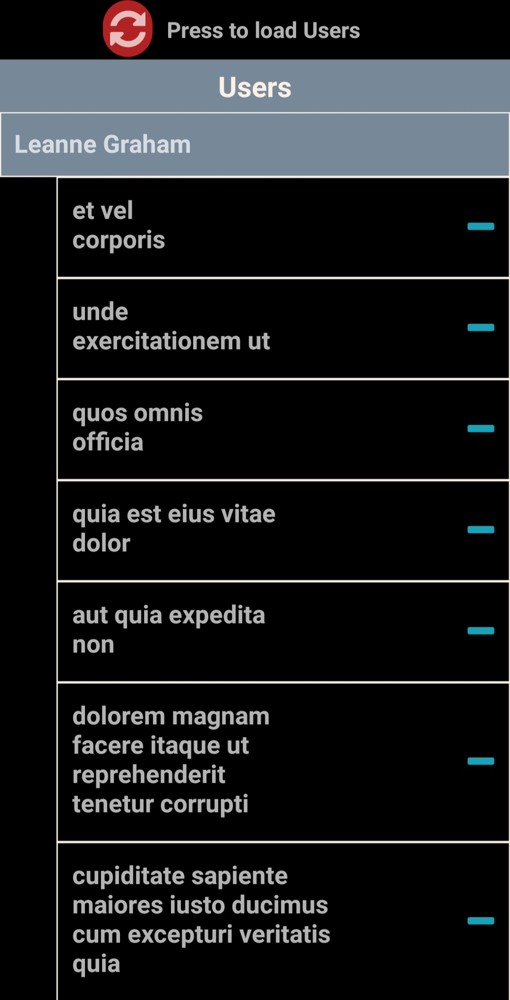
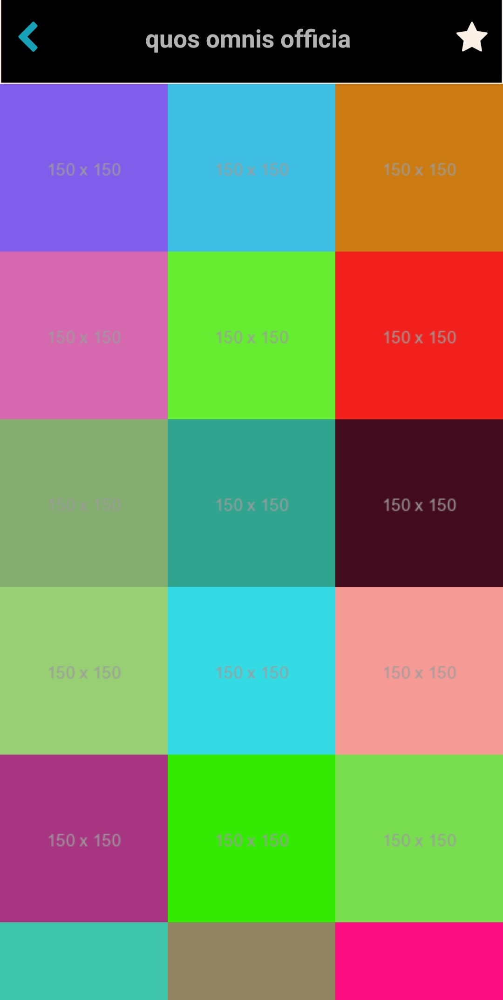

# Bswh-app

## Description

This is a React Native app that allows users to browse and view photos of different users. It utilizes Redux for state management and React Navigation for seamless navigation between screens. The app provides a user-friendly interface with three main screens: "Users", "Albums", and "Photos". Users can explore a list of users and view their respective photo collections.

## Features

- Browse and view photos of different users
- Seamless navigation between the "Users" and "Photos" screens
- Clean and responsive design
- Integration with Redux for efficient state management

## Installation

1. Clone the repository:

```typescript
git clone https://github.com/dithiane/bswh-app
```

2. Install dependencies:

```typescript
npm install
```

3. Start the Metro bundler by running the following command:

```typescript
npx react-native start
```

This will start the Metro bundler, which will compile and bundle your JavaScript code.

4. In a separate terminal window, build and install the app on your Android device or emulator by running the following command:

```typescript
npx react-native run-android
```

This command will compile your app's source code and install the APK on your Android device or emulator. The Metro bundler will automatically detect any changes you make to your JavaScript code and update the app accordingly.

5. Launch the app on your Android device or emulator, and you should see the "Users" and "Albums" screens. You can navigate between the screens and interact with the app as desired.

# Technologies Used

- React Native
- Redux
- React Navigation

# Screenshots



